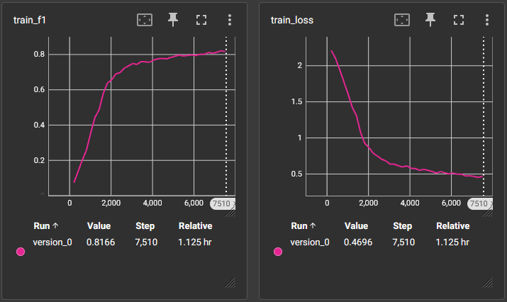
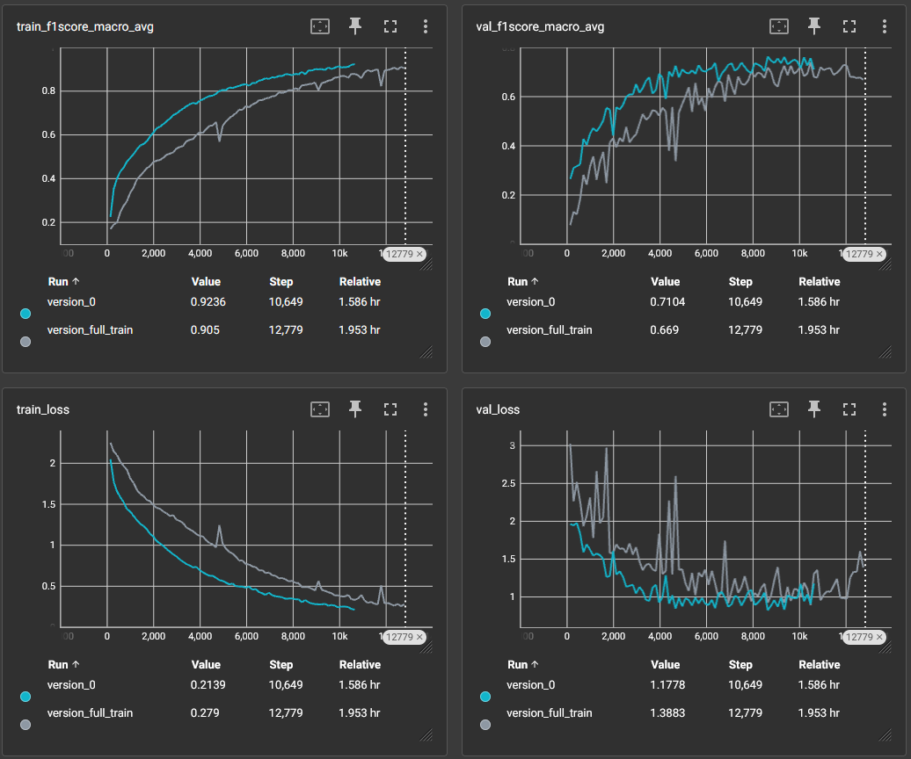
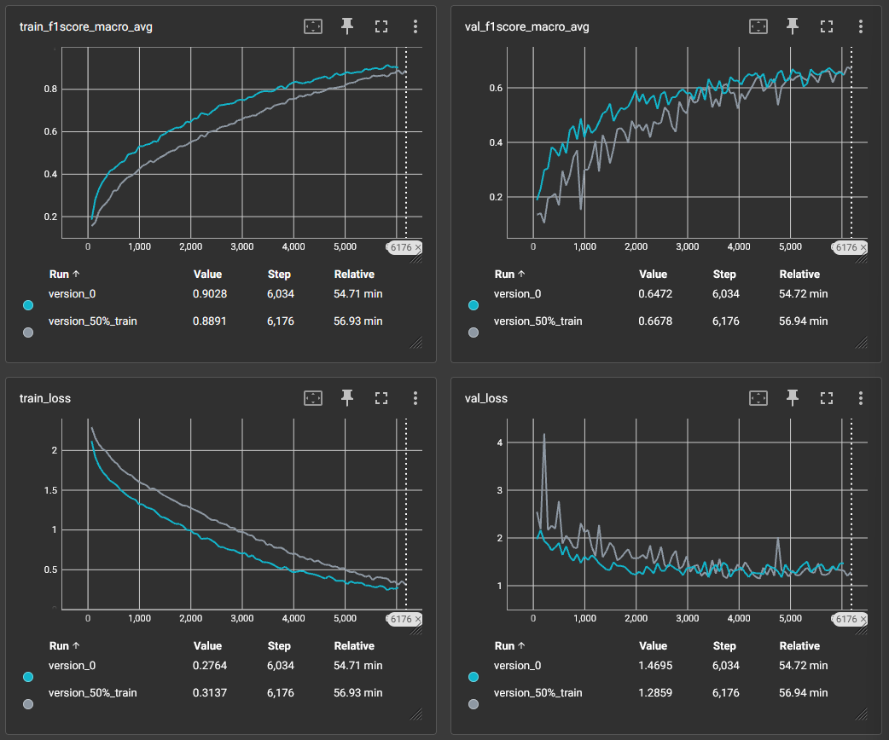
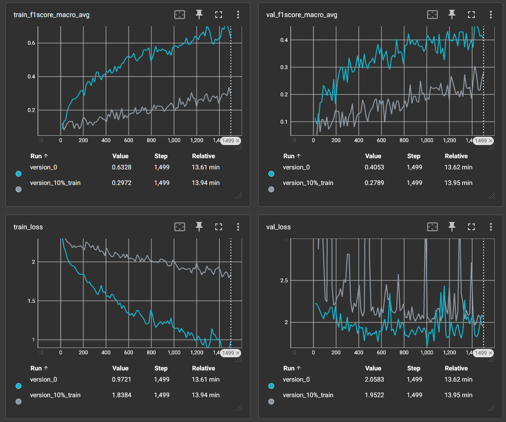

# processing-and-generating-images-course

## Описание

Предобучение feature extractor архитектуры ResNet осуществлялось с помощью техники Self-Supervised Learning (visual context prediction). Для этого каждое изображение сначала разбивалось на 9 патчей, потом выбирался центральный и еще один случайный относительно него. После чего они подавались на вход модели, которая должна была предсказать положение патча относительно центрального. Результаты предобучения приведены ниже.

## Эксперимент 1

Используется 100% размеченной выборки

Голубым цветом показаны графики обучения модели с предобученным feature extractor, а серым - без него.

Если посмотреть на графики loss функций и метрик, то можно заметить ускоренную сходимость, более быстрое достижение метрик, а также стабильное обучение. Максимальные средние метрики F1-score тоже выросли: 0.76 против 0.74 на валидационной выборке

## Эксперимент 2

Используется 50% размеченной выборки

Голубым цветом показаны графики обучения модели с предобученным feature extractor, а серым - без него.

В начале и середине обучения наблюдаются все те же преимущества, что и в первом эксперименте: ускоренная сходимость, стабилицазия обучения и более быстрое достижение метрик. Однако ближе к концу обучения преимущества теряются и методы показывают одинаковые максимальные средние результаты метрик: F1-score 0.68 на валидационной выборке.

## Эксперимент 3

Используется 10% размеченной выборки

Голубым цветом показаны графики обучения модели с предобученным feature extractor, а серым - без него.

Здесь видно сильный прирост по максимальным метрикам за 100 эпох: 0.72 и 0.34 на тренировочном наборе и 0.46 против 0.3 на валидационном. Графики функций потерь также показывают ускоренную сходимость к значительно меньшему минимальному значению loss: 0.79 и 1.84 соответственно

## Выводы

Во всех трёх экспериментах применение техники Self-Supervised Learning дало прирост к скорости сходимости и достижения максимальных метрик. Также в 1 и 3 экспериментах были зафиксированы новые максимумы метрик, а обучение в целом проходило более стабильно.