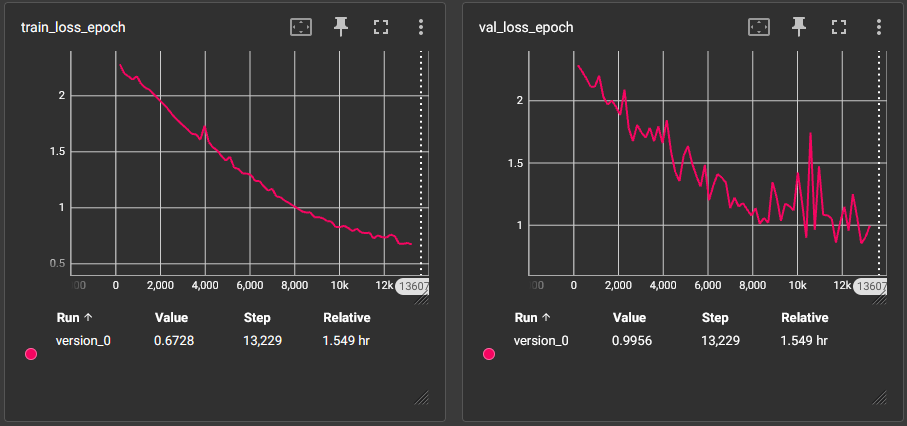
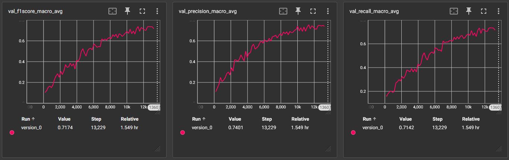

# processing-and-generating-images-course

## Информация

ФИО: Гордиенко Максим Александрович

Курс: Обработка и генерация изображений

Задача: Многоклассовая классификация (распознавание породы собак)

Датасет: [Imagewoof](https://github.com/fastai/imagenette#imagewoof)

Классы:

1. Shih-Tzu
2. Rhodesian ridgeback
3. Beagle
4. English foxhound
5. Australian terrier
6. Border terrier
7. Golden retriever
8. Old English sheepdog
9. Samoyed
10. Dingo

Архитектура: ResNet

Гиперпараметры:

* optimizer: AdamW
* learning rate: 1e-3
* image size: 256
* batch size: 48

Графики loss функций:

Графики метрик:

Значения метрик на val датасете:

| Класс                | F1Score | Precision | Recall |
|----------------------|---------|-----------|--------|
| Shih-Tzu             | 0.69    | 0.6       | 0.82   |
| Rhodesian ridgeback  | 0.77    | 0.76      | 0.77   |
| Beagle               | 0.65    | 0.71      | 0.61   |
| English foxhound     | 0.55    | 0.75      | 0.43   |
| Australian terrier   | 0.75    | 0.7       | 0.82   |
| Border terrier       | 0.76    | 0.86      | 0.68   |
| Golden retriever     | 0.69    | 0.64      | 0.76   |
| Old English sheepdog | 0.78    | 0.84      | 0.74   |
| Samoyed              | 0.81    | 0.77      | 0.87   |
| Dingo                | 0.71    | 0.79      | 0.65   |
| **Macro average**    | 0.72    | 0.74      | 0.71   |

[Примеры работы сети](notebooks/resnet_predict_demo.ipynb)